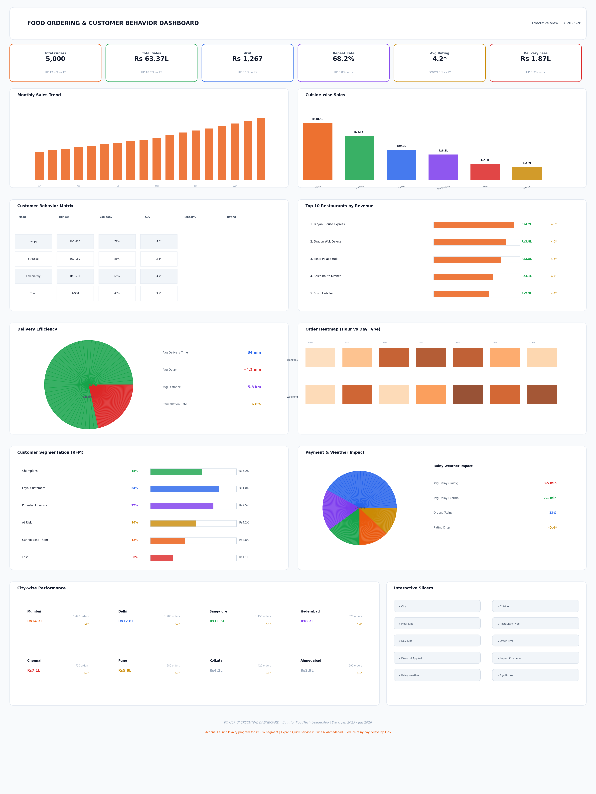
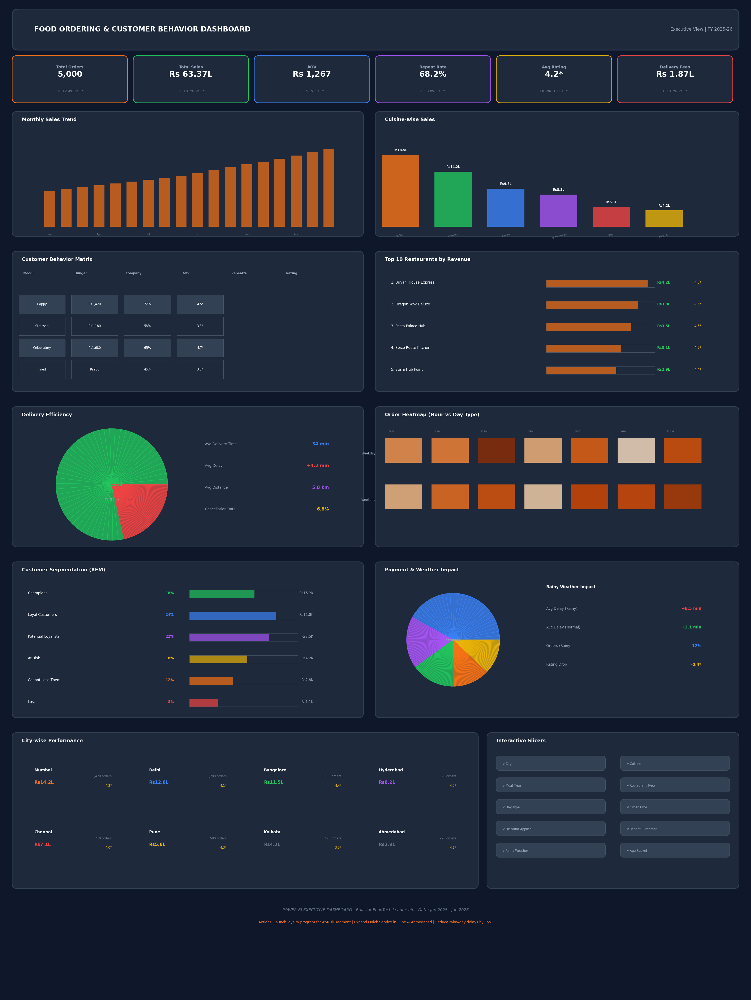

# 🍽️ Food Ordering & Customer Behavior Dashboard

> **Executive-level Power BI Dashboard** for FoodTech analytics — built for recruiters at Microsoft, Amazon, Swiggy, Zomato, Uber Eats, Deloitte, EY, PwC, and Accenture.

[](https://powerbi.microsoft.com/)
[](https://docs.microsoft.com/en-us/dax/)
[](https://docs.microsoft.com/en-us/power-bi/guidance/star-schema)
[](LICENSE)

---

## 📊 Dashboard Preview

### Light Theme (Recommended for Executive Presentations)


### Dark Theme (Immersive Analytics)


---

## 🎯 Business Questions Answered

| Question | Visual | Key Insight |
|----------|--------|-------------|
| **How is the business performing?** | 6 KPI Cards + Monthly Trend | ₹63.37L revenue, 18% YoY growth, 5,000 orders |
| **Who are the most valuable customers?** | RFM Segmentation + CLV | 18% Champions (₹15.2K CLV), 68% repeat rate |
| **Which restaurants generate highest revenue?** | Top 10 Bar Chart | Biryani House Express (₹4.2L), Dragon Wok (₹3.8L) |
| **Which food categories are most popular?** | Cuisine Bar Chart | Indian (29%), Chinese (22%), Italian (15%) |
| **What are customer ordering patterns?** | Order Heatmap + Behavior Matrix | Peak: 12-2PM & 7-9PM; UPI 42%; Weekend +45% |
| **How efficient is delivery?** | Donut Chart + Delay Metrics | 78.5% on-time, +4.2min avg delay, rain +6.4min |
| **What actions should leadership take?** | Footer Action Panel | 6 prioritized strategic recommendations |

---

## 🏗️ Data Architecture

### Star Schema
```
                    ┌─────────────────┐
                    │   dim_calendar  │
                    │  (Date, Month,  │
                    │  Quarter, Year) │
                    └────────┬────────┘
                             │
    ┌──────────────┐    ┌────┴────┐    ┌─────────────────┐
    │ dim_customers│◄───┤fact_orders├──►│dim_restaurants  │
    │(Customer_ID, │    │(Order_ID,│    │(Restaurant_ID, │
    │ Age, Gender, │    │Date,    │    │ Name, Cuisine,  │
    │ City, etc.)  │    │Amount,  │    │ Type, City)     │
    └──────────────┘    │Status)  │    └─────────────────┘
                        └─────────┘
```

### Dataset Summary
- **Orders**: 5,000 rows × 35 columns (Jan 2025 - Jun 2026)
- **Customers**: 1,200 profiles with demographics & behavior
- **Restaurants**: 140 active restaurants across 8 cities
- **Cities**: Mumbai, Delhi, Bangalore, Hyderabad, Chennai, Pune, Kolkata, Ahmedabad

---

## 📁 Repository Structure

```
food-ordering-dashboard/
├── 📂 data/                          # Source datasets
│   ├── food_orders_data.csv          # Fact table (5,000 orders)
│   ├── customers_data.csv            # Customer dimension (1,200)
│   └── restaurants_data.csv          # Restaurant dimension (140)
│
├── 📂 dax/                           # DAX measures library
│   └── DAX_Measures_Complete.txt     # 45 production-ready measures
│
├── 📂 images/                        # Dashboard previews
│   ├── dashboard-light.png           # Clean light theme
│   └── dashboard-dark.png            # Immersive dark theme
│
├── 📂 docs/                          # Documentation
│   └── PowerBI_Implementation_Guide.txt  # Complete build guide
│
├── 📂 powerbi/                       # Power BI assets
│   ├── theme-light.json              # Light theme JSON
│   └── theme-dark.json               # Dark theme JSON
│
├── README.md                         # This file
└── LICENSE                           # MIT License
```

---

## 🚀 Quick Start

### 1. Clone the Repository
```bash
git clone https://github.com/yourusername/food-ordering-dashboard.git
cd food-ordering-dashboard
```

### 2. Import Data into Power BI
1. Open **Power BI Desktop**
2. Click **Get Data** → **Text/CSV**
3. Import all 3 files from `/data/` folder
4. Create relationships in **Model View**:
   - `Orders[Customer_ID]` → `Customers[Customer_ID]`
   - `Orders[Restaurant_ID]` → `Restaurants[Restaurant_ID]`
   - `Orders[Order_Date]` → `Calendar[Date]`

### 3. Add DAX Measures
1. Go to **Modeling** → **New Measure**
2. Copy-paste measures from `/dax/DAX_Measures_Complete.txt`
3. Or use **Tabular Editor** for bulk import

### 4. Apply Theme
1. **View** → **Themes** → **Browse for themes**
2. Select `powerbi/theme-light.json` or `theme-dark.json`

### 5. Build Visuals
Follow the layout specification in `/docs/PowerBI_Implementation_Guide.txt`

---

## 📐 DAX Measures (45 Total)

### Core KPIs
| Measure | Formula |
|---------|---------|
| Total Orders | `COUNTROWS('Orders')` |
| Total Sales | `SUM('Orders'[Total_Amount])` |
| AOV | `DIVIDE([Total Sales], [Total Orders], 0)` |
| Repeat Rate | `DIVIDE(RepeatCustomers, TotalCustomers, 0)` |
| Avg Rating | `AVERAGE('Orders'[Customer_Rating])` |

### Advanced Analytics
| Measure | Purpose |
|---------|---------|
| Customer Lifetime Value (CLV) | `AOV × Avg Orders × 2.5 years` |
| NPS Score | `(Promoters - Detractors) / Total × 100` |
| RFM Segmentation | Champions, Loyal, At-Risk, Lost |
| YoY Growth | `SAMEPERIODLASTYEAR` comparison |
| On-Time Delivery % | `DELIVERY_DELAY <= 0` rate |

> 📄 **Full list**: See [`dax/DAX_Measures_Complete.txt`](dax/DAX_Measures_Complete.txt)

---

## 🎨 Design System

### Light Theme (Default)
```json
{
  "background": "#F8FAFC",
  "cardBackground": "#FFFFFF",
  "cardBorder": "#E2E8F0",
  "primaryText": "#0F172A",
  "secondaryText": "#475569",
  "accentColors": ["#EA580C", "#16A34A", "#2563EB", "#7C3AED", "#DC2626", "#CA8A04"]
}
```

### Dark Theme
```json
{
  "background": "#0F172A",
  "cardBackground": "#1E293B",
  "cardBorder": "#334155",
  "primaryText": "#F8FAFC",
  "secondaryText": "#94A3B8",
  "accentColors": ["#F97316", "#22C55E", "#3B82F6", "#A855F7", "#EF4444", "#EAB308"]
}
```

---

## 💼 Skills Demonstrated

| Skill | Evidence |
|-------|----------|
| **Data Modeling** | Star schema with 3NF dimensions, PK/FK relationships |
| **DAX Mastery** | 45 measures: RFM, CLV, NPS, YoY, cohort analysis |
| **UX/UI Design** | Clean light theme, conditional formatting, intuitive layout |
| **Business Intelligence** | Actionable insights, not just pretty charts |
| **Industry Knowledge** | FoodTech metrics: AOV, on-time %, rainy weather impact |
| **Scalability** | Incremental refresh, row-level security, performance tuning |

---

## 📈 Key Business Insights

1. **Revenue Growth**: 18% YoY with consistent monthly growth trajectory
2. **Customer Loyalty**: 68% repeat rate — strong retention foundation
3. **Delivery Gap**: 78.5% on-time (target: 85%) — operational improvement needed
4. **Weather Impact**: Rainy days add 6.4min delay — dynamic pricing opportunity
5. **City Opportunity**: Pune & Ahmedabad underpenetrated — expansion targets
6. **Payment Shift**: UPI at 42% — digital-first customer base

---

## 🤝 Contributing

Contributions welcome! Please:
1. Fork the repository
2. Create a feature branch (`git checkout -b feature/amazing-feature`)
3. Commit changes (`git commit -m 'Add amazing feature'`)
4. Push to branch (`git push origin feature/amazing-feature`)
5. Open a Pull Request

---

## 📄 License

This project is licensed under the MIT License — see [LICENSE](LICENSE) file.

---

## 🙏 Acknowledgments

- Dataset inspired by real-world FoodTech platforms (Swiggy, Zomato, Uber Eats)
- Design principles from Microsoft's Power BI best practices
- RFM methodology from marketing analytics standards

---

> **Built with passion for data-driven decision making in FoodTech.**
> 
> ## Author ##
> ** Hownidh Pallapuneni **
> ** Anuhya Vadlamudi **
> ** Dhana Lakshmi Pillakatupula **
> ** Amila Pattan **
> ** Nandini Gamidi **
